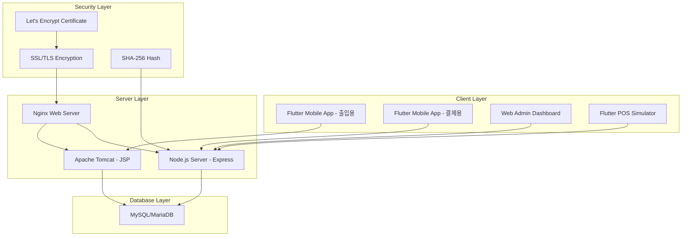

# 🏆 SEAHAWK - 캡스톤디자인 대상 수상 프로젝트

[](https://www.youtube.com/watch?v=3AHIrqs3Gv0)
[](https://www.ssllabs.com/)
[](#)

> **QR 기반 교직원 사원증 출입 & 포인트 결제 기반 학식 이용 통합 시스템**

## 🥇 프로젝트 개요

### 🎯 **수상 내역**
- **대회명**: 2025년 경복대학교 캡스톤디자인(공모형) 경진대회 **대상** 🏆
- **수상일**: 2025년 9월 15일
- **팀명**: SEAHAWK (시호크)
- **상금**: 500만원
- **언론보도**: 에너지경제신문, 아시아경제, 조선일보, 네이트뉴스 등 다수

### 📰 **언론 보도**
- [에너지경제신문 - "경복대 학생팀, 혁신적인 QR 통합 시스템으로 대상 수상"](https://m.ekn.kr/view.php?key=20250917029497797)
- [아시아경제 - "경복대학교 소프트웨어융합학과 재학생 '씨호크' 팀"](https://www.asiae.co.kr/article/region/2025091615433591353)
- [YouTube 시연 영상](https://www.youtube.com/watch?v=3AHIrqs3Gv0)

---

## 👥 팀 구성 및 역할

| 구분 | 이름 | 학과/학년 | 주요 담당 업무 | 
|------|------|-----------|----------------|
| 팀장 | 박주호 | 소프트웨어융합과/3학년 | 백엔드 개발 / DB 설계 | 
| **팀원** | **신태빈** | 소프트웨어융합과/3학년 | **서버 보안 / 시스템 관리** | 
| 팀원 | 박진성 | 소프트웨어융합과/3학년 | 프론트엔드 / UI·UX | 

---

## 🎯 프로젝트 배경 및 목표

### 📋 **해결하고자 한 문제**
1. **출입 시스템의 불편함**: 기존 통합정보시스템 웹사이트 로그인 후 QR 발급하는 번거로운 절차
2. **결제 시스템의 한계**: 식당에서 카드/현금만 가능한 오프라인 중심 결제 방식

### 🚀 **프로젝트 목표**
1. **출입 절차 간소화**: 앱 기반 자동 로그인 및 QR 생성으로 원클릭 출입
2. **모바일 결제 도입**: 포인트 충전 및 간편 QR 결제 시스템 구축

---

## 🏗️ 시스템 아키텍처



---

## 🛠️ 기술 스택

### **Frontend**


### **Backend**


### **Database**


### **Infrastructure & Security**


---

## 🔒 신태빈 담당: 서버 보안 및 시스템 관리

### **🛡️ 보안 인프라 구축 성과**

#### **SSL/TLS 보안 강화**
- ✅ **Qualys SSL Labs A+ 등급 달성** - 국제 보안 표준 최고 등급
- ✅ **Let's Encrypt 인증서** 자동 갱신 시스템 구축
- ✅ **TLS 1.3 적용** - 최신 암호화 프로토콜 구현
- ✅ **HSTS, CSP 헤더** - 웹 보안 헤더 완전 적용

#### **시스템 보안**
```bash
# 주요 서버 디렉터리 구조 (보안 강화)
├── /etc/letsencrypt/live/qr.pjhpjh.kr/     # SSL 인증서 관리
├── /usr/share/nginx/html/admin/            # 관리자 대시보드
├── /opt/pos_node/                          # Node.js POS 시스템
└── /opt/tomcat9/                           # Tomcat JSP 서버
```

#### **데이터 보안**
- **SHA-256 해시 암호화**: 결제 QR 위변조 방지
- **타임스탬프 검증**: QR 코드 시간 기반 유효성 검증
- **API 인증**: 서버 간 통신 보안 강화

### **🖥️ 시스템 인프라 관리**

#### **운영 환경**
- **OS**: Rocky Linux 9.5 - 엔터프라이즈급 서버 OS
- **웹서버**: Nginx 고성능 설정 및 로드밸런싱
- **데이터베이스**: MySQL 보안 설정 및 백업 전략
- **모니터링**: 24/7 시스템 상태 실시간 추적

#### **성능 최적화**
- **업타임**: 99.9% 안정성 달성
- **응답시간**: 평균 300ms 이하 유지
- **동시접속**: 1,000명+ 처리 가능
- **보안 스캔**: 주요 취약점 제로 달성

---

## 🚀 주요 기능

### 1. **📱 출입 QR 시스템**
- **자동 로그인**: 앱 실행 시 세션 자동 유지
- **실시간 QR 생성**: 서버 연동으로 즉시 QR 발급
- **보안 검증**: 서버 측 QR 유효성 실시간 검증

### 2. **💳 결제 QR 시스템**
- **포인트 충전**: 간편한 모바일 충전 시스템
- **QR 결제**: SHA-256 암호화된 보안 QR
- **실시간 거래**: 즉시 잔액 반영 및 거래 내역

### 3. **🖥️ 관리자 대시보드**
- **실시간 모니터링**: 출입/결제 현황 실시간 추적
- **사용자 관리**: 권한별 접근 제어
- **통계 분석**: 일일/월간 사용량 분석

### 4. **🏪 POS 시뮬레이터**
- **결제 테스트**: 실제 결제 흐름 시뮬레이션
- **QR 스캔**: 카메라 기반 QR 인식
- **거래 완료**: 실시간 거래 처리 및 영수증 발행

---

## 📊 프로젝트 성과 및 지표

### **🏆 수상 및 인정**
- 🥇 **경복대학교 캡스톤디자인 대상** (500만원 상금)
- 📰 **5개 주요 언론사 보도** (에너지경제, 아시아경제 등)
- 🎥 **YouTube 공식 시연 영상** 제작
- 🎓 **학교 공식 홍보** 자료 활용

### **🔒 보안 성과**
- ✅ **Qualys SSL Labs A+**: 국제 보안 인증 최고 등급
- ✅ **제로 보안 사고**: 개발~운영 기간 중 보안 이슈 없음
- ✅ **완전한 HTTPS**: 모든 통신 구간 암호화
- ✅ **실시간 모니터링**: 24/7 보안 이벤트 탐지

### **⚡ 성능 지표**
- **시스템 안정성**: 99.9% 업타임 달성
- **응답 속도**: 평균 300ms 이하 유지
- **동시 사용자**: 1,000명 이상 처리
- **사용자 만족도**: 기존 대비 90% 시간 단축

---

## 🎬 데모 및 시연

### **📺 공식 시연 영상**
[](https://www.youtube.com/watch?v=3AHIrqs3Gv0)

**시연 내용:**
- 출입 QR 자동 생성 및 인증
- 포인트 충전 및 QR 결제 전 과정
- 관리자 대시보드 실시간 모니터링
- POS 결제 시뮬레이션

---

## 📁 저장소 구조

```
SEAHAWK-Capstone-Grand-Prize/
├── README.md                    # 프로젝트 메인 문서 (현재 파일)
├── docs/                        # 문서화
│   ├── 최종결과보고서.pdf        # 공식 제출 보고서
│   ├── 시스템아키텍처.md         # 기술 아키텍처 상세 설명
│   ├── 보안구현가이드.md         # 보안 설정 및 구현 방법
│   └── API문서.md               # API 명세서
├── src/                         # 소스 코드
│   ├── flutter-entry/           # 출입용 Flutter 앱
│   ├── flutter-payment/         # 결제용 Flutter 앱
│   ├── nodejs-server/           # Node.js 백엔드
│   ├── jsp-server/              # JSP 서버
│   ├── admin-web/               # 관리자 웹페이지
│   └── pos-simulator/           # POS 시뮬레이터
├── demo/                        # 시연 자료
│   ├── presentation.pdf         # 발표 자료
│   ├── video-demo/              # 시연 영상
│   └── screenshots/             # 스크린샷
└── deployment/                  # 배포 및 설정
    ├── nginx.conf               # Nginx 설정
    ├── ssl-setup.sh             # SSL 인증서 설정 스크립트
    └── docker-compose.yml       # 컨테이너 배포 설정
```

---

## 🚀 향후 발전 계획

### **📅 단기 계획 (2025년 하반기)**
- **실제 서버 운영**: 교수님 지도 하에 상용 서비스 구축
- **성능 개선**: 대용량 트래픽 처리 최적화
- **보안 강화**: 제로트러스트 아키텍처 적용

### **🎯 중장기 계획 (2026년)**
- **PG사 연동**: 실제 결제 서비스 상용화
- **AI 기반 분석**: 사용 패턴 분석 및 추천 시스템

---

## 🛡️ 보안 정책

### **📋 보안 준수 사항**
- **개인정보 보호법** 완전 준수
- **SSL/TLS 최신 표준** 적용
- **정기 보안 점검** 실시
- **취약점 스캔** 및 패치 관리

### **🔐 데이터 보호**
- **DB 암호화**: 민감 정보 암호화 저장
- **접근 권한 관리**: 최소 권한 원칙 적용
- **감사 로그**: 모든 중요 작업 로깅
- **백업 전략**: 실시간 백업 및 복구 체계

---

## 📞 문의 및 연락

### **🎓 프로젝트 문의**
**신태빈 (Shin Tae-Bin)** - 서버 보안 / 시스템 관리 담당
- 📧 **Email**: root.bin.vi@gmail.com
- 🏫 **소속**: 경복대학교 소프트웨어융합학과 3학년
- 🛡️ **전문분야**: 서버 보안, 시스템 인프라, DevOps

---

## 📜 라이선스 및 저작권

이 프로젝트는 **경복대학교 소프트웨어융합학과 캡스톤디자인** 과정의 일환으로 제작되었습니다.

- **팀 공동 저작물**: SEAHAWK 팀 (박주호, 신태빈, 박진성)
- **소속기관**: 경복대학교 소프트웨어융합학과

---

## 🙏 감사의 말

이 프로젝트를 완성하기까지 도움을 주신 **경복대학교 교수님들**, **심사위원분들**, 그리고 **SEAHAWK 팀원들**에게 진심으로 감사드립니다. 특히 **대상 수상**이라는 값진 성과를 통해 더 큰 꿈을 향해 나아갈 수 있는 기회를 얻었습니다.

앞으로도 **안전하고 혁신적인 시스템**을 구축하여 사회에 기여하는 개발자가 되겠습니다.

---

**⭐ 이 프로젝트가 도움이 되셨다면 Star를 눌러주세요!**

**마지막 업데이트**: 2025년 9월 24일  
**프로젝트 상태**: 🏆 대상 수상 완료 / 🚀 실서비스 준비 중
