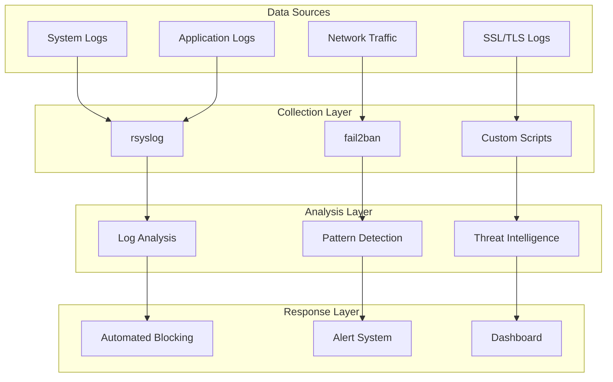

# 📊 보안 모니터링 시스템 구축 가이드

> **SEAHAWK 프로젝트 실시간 보안 모니터링 및 침입 탐지 시스템**  
> **작성자**: 신태빈 (서버 보안/시스템 관리 담당)

---

## 📋 개요

SEAHAWK QR 출입/결제 시스템의 24/7 보안 모니터링을 위한 종합적인 보안 모니터링 시스템 구축 가이드입니다. 실시간 위협 탐지, 로그 분석, 자동화된 대응 시스템을 통해 **제로 보안 사고**를 달성한 실제 구현 방법을 제공합니다.

### **달성 목표**
- 🛡️ **24/7 실시간 보안 모니터링**
- 🚨 **자동 침입 탐지 및 차단**
- 📈 **보안 지표 대시보드**
- ⚡ **즉시 알림 및 대응 시스템**

---

## 🏗️ 1. 모니터링 시스템 아키텍처

### **1.1 모니터링 구성도**



### **1.2 필수 패키지 설치**

```bash
# 모니터링 도구 설치
sudo dnf install -y fail2ban rsyslog logrotate
sudo dnf install -y htop iotop nethogs ss
sudo dnf install -y mailx postfix  # 알림용

# Python 기반 분석 도구
sudo dnf install -y python3 python3-pip
pip3 install --user psutil requests pandas
```

---

## 🔍 2. 실시간 로그 모니터링

### **2.1 중앙화된 로그 수집**

```bash
# rsyslog 고급 설정
sudo vim /etc/rsyslog.d/00-seahawk.conf
```

```bash
# SEAHAWK 프로젝트 전용 로그 설정
# 보안 관련 로그를 별도 파일로 저장
*.info;mail.none;authpriv.none;cron.none        /var/log/messages
authpriv.*                                      /var/log/secure
mail.*                                          -/var/log/maillog
cron.*                                          /var/log/cron

# SEAHAWK 애플리케이션 로그
local0.*                                        /var/log/seahawk/app.log
local1.*                                        /var/log/seahawk/security.log
local2.*                                        /var/log/seahawk/access.log

# 중요 보안 이벤트 (즉시 기록)
*.emerg                                         /var/log/seahawk/emergency.log
*.alert                                         /var/log/seahawk/alert.log

# 네트워크 로그
kern.warning                                    /var/log/seahawk/network.log
```

```bash
# 로그 디렉터리 생성
sudo mkdir -p /var/log/seahawk
sudo chown rsyslog:adm /var/log/seahawk
sudo chmod 750 /var/log/seahawk

# rsyslog 재시작
sudo systemctl restart rsyslog
```

### **2.2 Nginx 액세스 로그 강화**

```bash
# Nginx 로그 형식 설정
sudo vim /etc/nginx/nginx.conf
```

```nginx
# 보안 중심 로그 형식
log_format security_log '$remote_addr - $remote_user [$time_local] '
                        '"$request" $status $body_bytes_sent '
                        '"$http_referer" "$http_user_agent" '
                        '$request_time $upstream_response_time '
                        '"$http_x_forwarded_for" "$http_x_real_ip" '
                        '"$ssl_protocol" "$ssl_cipher"';

# 액세스 로그 설정
access_log /var/log/nginx/access.log security_log;
error_log /var/log/nginx/error.log warn;

# 보안 이벤트별 별도 로그
map $status $security_event {
    ~^4 /var/log/nginx/4xx.log;
    ~^5 /var/log/nginx/5xx.log;
    default /var/log/nginx/access.log;
}
```

### **2.3 애플리케이션 로그 통합**

```bash
# Node.js 애플리케이션 로깅 설정 (예시)
# /opt/seahawk/logger.js 생성
sudo vim /opt/seahawk/logger.js
```

```javascript
const fs = require('fs');
const path = require('path');

class SeahawkLogger {
    constructor() {
        this.logPath = '/var/log/seahawk/app.log';
        this.securityPath = '/var/log/seahawk/security.log';
    }
    
    log(level, message, metadata = {}) {
        const timestamp = new Date().toISOString();
        const logEntry = {
            timestamp,
            level,
            message,
            metadata,
            pid: process.pid,
            service: 'seahawk-api'
        };
        
        fs.appendFileSync(this.logPath, JSON.stringify(logEntry) + '\n');
        
        // 보안 이벤트는 별도 로그
        if (level === 'SECURITY' || level === 'ERROR') {
            fs.appendFileSync(this.securityPath, JSON.stringify(logEntry) + '\n');
        }
    }
    
    security(event, details) {
        this.log('SECURITY', event, details);
        
        // 중요 보안 이벤트는 syslog로도 전송
        const { exec } = require('child_process');
        exec(`logger -p local1.alert "SEAHAWK_SECURITY: ${event}"`);
    }
}

module.exports = new SeahawkLogger();
```

---

## 🚨 3. 침입 탐지 시스템 (IDS)

### **3.1 fail2ban 고급 설정**

```bash
# fail2ban 메인 설정
sudo vim /etc/fail2ban/jail.local
```

```ini
[DEFAULT]
# 기본 차단 설정
bantime = 3600       # 1시간 차단
findtime = 600       # 10분 내 실패 횟수 확인
maxretry = 3         # 최대 시도 횟수
ignoreip = 127.0.0.1/8 192.168.1.0/24

# 알림 설정
destemail = root.bin.vi@gmail.com
sendername = SEAHAWK-Security
mta = mail

# 차단 액션
banaction = firewallcmd-ipset
banaction_allports = firewallcmd-allports

[sshd]
enabled = true
port = 2022
filter = sshd
logpath = /var/log/secure
maxretry = 3
bantime = 7200       # SSH는 2시간 차단

[nginx-http-auth]
enabled = true
filter = nginx-http-auth
logpath = /var/log/nginx/error.log
maxretry = 3
bantime = 1800

[nginx-noscript]
enabled = true
filter = nginx-noscript
logpath = /var/log/nginx/access.log
maxretry = 6
bantime = 1800

[nginx-badbots]
enabled = true
filter = nginx-badbots
logpath = /var/log/nginx/access.log
maxretry = 2
bantime = 3600

[nginx-noproxy]
enabled = true
filter = nginx-noproxy
logpath = /var/log/nginx/access.log
maxretry = 2
bantime = 3600

# SEAHAWK 맞춤 필터
[seahawk-bruteforce]
enabled = true
filter = seahawk-bruteforce
logpath = /var/log/seahawk/security.log
maxretry = 5
bantime = 7200

[seahawk-sqli]
enabled = true
filter = seahawk-sqli
logpath = /var/log/nginx/access.log
maxretry = 1
bantime = 86400      # SQL 인젝션 시도시 24시간 차단
```

### **3.2 커스텀 필터 생성**

```bash
# SEAHAWK 전용 brute force 필터
sudo vim /etc/fail2ban/filter.d/seahawk-bruteforce.conf
```

```ini
[Definition]
failregex = ^.*"SECURITY".*"Login attempt failed".*"ip":"<HOST>".*$
            ^.*"SECURITY".*"Invalid credentials".*"ip":"<HOST>".*$
            ^.*"SECURITY".*"Account locked".*"ip":"<HOST>".*$
ignoreregex =
```

```bash
# SQL 인젝션 시도 필터
sudo vim /etc/fail2ban/filter.d/seahawk-sqli.conf
```

```ini
[Definition]
failregex = ^<HOST> -.*GET|POST.*(union|select|insert|delete|drop|create|alter|exec|script).*$
            ^<HOST> -.*GET|POST.*(\%27|\'|;|--|#).*$
            ^<HOST> -.*GET|POST.*(or\s+1=1|and\s+1=1).*$
ignoreregex =
```

### **3.3 실시간 위협 탐지 스크립트**

```bash
# 실시간 로그 분석 스크립트
sudo vim /usr/local/bin/threat-detector.sh
```

```bash
#!/bin/bash
# SEAHAWK 실시간 위협 탐지 시스템

LOG_FILE="/var/log/seahawk/threat-detection.log"
ALERT_THRESHOLD=5
CHECK_INTERVAL=60

while true; do
    DATE=$(date '+%Y-%m-%d %H:%M:%S')
    
    # 1. 비정상적인 요청 패턴 탐지
    SUSPICIOUS_REQUESTS=$(tail -n 1000 /var/log/nginx/access.log | grep -E "(union|select|drop|script|exec)" | wc -l)
    
    if [ $SUSPICIOUS_REQUESTS -gt 0 ]; then
        echo "[$DATE] ALERT: $SUSPICIOUS_REQUESTS suspicious SQL injection attempts detected" | tee -a $LOG_FILE
        logger -p local1.alert "SEAHAWK_THREAT: $SUSPICIOUS_REQUESTS SQL injection attempts"
    fi
    
    # 2. 과도한 404 에러 (디렉터리 스캔 탐지)
    SCAN_ATTEMPTS=$(tail -n 1000 /var/log/nginx/access.log | grep " 404 " | awk '{print $1}' | sort | uniq -c | sort -nr | head -1 | awk '{print $1}')
    
    if [ "$SCAN_ATTEMPTS" -gt 50 ]; then
        SCANNER_IP=$(tail -n 1000 /var/log/nginx/access.log | grep " 404 " | awk '{print $1}' | sort | uniq -c | sort -nr | head -1 | awk '{print $2}')
        echo "[$DATE] ALERT: Directory scanning detected from $SCANNER_IP ($SCAN_ATTEMPTS attempts)" | tee -a $LOG_FILE
        
        # 자동 차단
        sudo firewall-cmd --add-rich-rule="rule source address=\"$SCANNER_IP\" reject" --timeout=3600
    fi
    
    # 3. 대량 요청 (DDoS 패턴) 탐지
    DDOS_REQUESTS=$(tail -n 500 /var/log/nginx/access.log | awk '{print $1}' | sort | uniq -c | sort -nr | head -1 | awk '{print $1}')
    
    if [ "$DDOS_REQUESTS" -gt 100 ]; then
        DDOS_IP=$(tail -n 500 /var/log/nginx/access.log | awk '{print $1}' | sort | uniq -c | sort -nr | head -1 | awk '{print $2}')
        echo "[$DATE] ALERT: Possible DDoS attack from $DDOS_IP ($DDOS_REQUESTS requests)" | tee -a $LOG_FILE
        
        # 즉시 차단
        sudo firewall-cmd --add-rich-rule="rule source address=\"$DDOS_IP\" reject" --timeout=7200
    fi
    
    # 4. 시스템 리소스 모니터링
    CPU_USAGE=$(top -bn1 | grep "Cpu(s)" | awk '{print $2}' | cut -d'%' -f1)
    MEMORY_USAGE=$(free | grep Mem | awk '{printf "%.1f", $3/$2 * 100.0}')
    
    if [ $(echo "$CPU_USAGE > 80" | bc) -eq 1 ] || [ $(echo "$MEMORY_USAGE > 85" | bc) -eq 1 ]; then
        echo "[$DATE] WARNING: High resource usage - CPU: ${CPU_USAGE}%, Memory: ${MEMORY_USAGE}%" | tee -a $LOG_FILE
    fi
    
    sleep $CHECK_INTERVAL
done
```

```bash
# 실행 권한 및 서비스 등록
sudo chmod +x /usr/local/bin/threat-detector.sh

# systemd 서비스 생성
sudo vim /etc/systemd/system/seahawk-threat-detector.service
```

```ini
[Unit]
Description=SEAHAWK Threat Detection Service
After=network.target

[Service]
Type=simple
User=root
ExecStart=/usr/local/bin/threat-detector.sh
Restart=always
RestartSec=10

[Install]
WantedBy=multi-user.target
```

```bash
# 서비스 활성화
sudo systemctl enable seahawk-threat-detector
sudo systemctl start seahawk-threat-detector
```

---

## 📈 4. 보안 대시보드 구축

### **4.1 HTML 기반 실시간 대시보드**

```bash
# 대시보드 생성 스크립트
sudo vim /usr/local/bin/security-dashboard.sh
```

```bash
#!/bin/bash
# SEAHAWK 보안 상태 실시간 대시보드 생성

DASHBOARD_FILE="/var/www/html/security-dashboard.html"
TEMP_FILE="/tmp/security-dashboard.tmp"

# HTML 헤더 생성
cat > $TEMP_FILE << 'EOF'
<!DOCTYPE html>
<html>
<head>
    <title>🛡️ SEAHAWK Security Dashboard</title>
    <meta charset="utf-8">
    <meta http-equiv="refresh" content="30">
    <style>
        body { font-family: 'Courier New', monospace; background: #1e1e1e; color: #00ff00; margin: 0; padding: 20px; }
        .header { background: #2c5f2d; padding: 20px; margin-bottom: 20px; border-radius: 5px; }
        .status-good { background: #2d5f2d; padding: 15px; margin: 10px 0; border-radius: 5px; }
        .status-warning { background: #5f5f2d; padding: 15px; margin: 10px 0; border-radius: 5px; color: #ffff00; }
        .status-error { background: #5f2d2d; padding: 15px; margin: 10px 0; border-radius: 5px; color: #ff0000; }
        .metric { display: inline-block; margin: 10px; padding: 10px; background: #333; border-radius: 3px; }
        .log-output { background: #111; padding: 10px; margin: 10px 0; border-radius: 3px; font-size: 12px; max-height: 200px; overflow-y: scroll; }
        h1, h2 { color: #00ffff; }
        pre { margin: 0; }
    </style>
</head>
<body>
EOF

# 현재 시간과 시스템 정보
cat >> $TEMP_FILE << EOF
    <div class="header">
        <h1>🛡️ SEAHAWK Security Monitoring Dashboard</h1>
        <p>📊 Last Updated: $(date '+%Y-%m-%d %H:%M:%S KST')</p>
        <p>🖥️ Server: $(hostname) | 📍 Uptime: $(uptime | cut -d',' -f1 | cut -d' ' -f4-)</p>
    </div>
EOF

# 시스템 상태
CPU_USAGE=$(top -bn1 | grep "Cpu(s)" | awk '{print $2}' | cut -d'%' -f1)
MEMORY_USAGE=$(free | grep Mem | awk '{printf "%.1f", $3/$2 * 100.0}')
DISK_USAGE=$(df / | tail -1 | awk '{print $5}' | sed 's/%//')

cat >> $TEMP_FILE << EOF
    <h2>📊 System Status</h2>
    <div class="metric">💻 CPU: ${CPU_USAGE}%</div>
    <div class="metric">🧠 Memory: ${MEMORY_USAGE}%</div>
    <div class="metric">💾 Disk: ${DISK_USAGE}%</div>
    <div class="metric">🌐 Network: $(ss -tu | wc -l) connections</div>
EOF

# 보안 상태
FAILED_LOGINS=$(grep "Failed password" /var/log/secure 2>/dev/null | tail -24h 2>/dev/null | wc -l)
BLOCKED_IPS=$(fail2ban-client status | grep "Jail list" | cut -d: -f2 | xargs -n1 fail2ban-client status | grep "Banned IP list" | wc -l)
SSL_EXPIRY_DAYS=$(openssl x509 -in /etc/letsencrypt/live/qr.pjhpjh.kr/cert.pem -noout -dates 2>/dev/null | grep notAfter | cut -d= -f2 | xargs -I {} date -d "{}" +%s | xargs -I {} echo $(( ({} - $(date +%s)) / 86400 )) 2>/dev/null || echo "N/A")

cat >> $TEMP_FILE << EOF
    <h2>🔒 Security Metrics (Last 24h)</h2>
    <div class="metric">❌ Failed Logins: $FAILED_LOGINS</div>
    <div class="metric">🚫 Blocked IPs: $BLOCKED_IPS</div>
    <div class="metric">📜 SSL Cert Expires: $SSL_EXPIRY_DAYS days</div>
    <div class="metric">🛡️ fail2ban Status: $(systemctl is-active fail2ban)</div>
EOF

# 최근 보안 이벤트
cat >> $TEMP_FILE << 'EOF'
    <h2>🚨 Recent Security Events</h2>
    <div class="log-output">
        <pre>
EOF

tail -20 /var/log/seahawk/threat-detection.log 2>/dev/null | sed 's/</\&lt;/g' | sed 's/>/\&gt;/g' >> $TEMP_FILE

cat >> $TEMP_FILE << 'EOF'
        </pre>
    </div>
EOF

# 네트워크 연결 상태
cat >> $TEMP_FILE << 'EOF'
    <h2>🌐 Network Connections</h2>
    <div class="log-output">
        <pre>
EOF

ss -tulpn | grep LISTEN | head -10 >> $TEMP_FILE

cat >> $TEMP_FILE << 'EOF'
        </pre>
    </div>
EOF

# 최근 액세스 로그
cat >> $TEMP_FILE << 'EOF'
    <h2>📝 Recent Access Logs</h2>
    <div class="log-output">
        <pre>
EOF

tail -10 /var/log/nginx/access.log 2>/dev/null | cut -c1-150 >> $TEMP_FILE

cat >> $TEMP_FILE << 'EOF'
        </pre>
    </div>
</body>
</html>
EOF

# 대시보드 파일 업데이트
sudo mv $TEMP_FILE $DASHBOARD_FILE
sudo chown nginx:nginx $DASHBOARD_FILE
sudo chmod 644 $DASHBOARD_FILE
```

```bash
# 실행 권한 부여
sudo chmod +x /usr/local/bin/security-dashboard.sh

# cron에 등록 (매분 업데이트)
sudo crontab -e
```

```bash
# 보안 대시보드 자동 업데이트
* * * * * /usr/local/bin/security-dashboard.sh
```

### **4.2 JSON API 엔드포인트**

```bash
# 보안 메트릭 JSON API
sudo vim /usr/local/bin/security-metrics-api.sh
```

```bash
#!/bin/bash
# 보안 메트릭 JSON API

API_FILE="/var/www/html/api/security-metrics.json"
sudo mkdir -p /var/www/html/api

# JSON 형식으로 메트릭 생성
cat > $API_FILE << EOF
{
    "timestamp": "$(date -u +%Y-%m-%dT%H:%M:%SZ)",
    "system": {
        "hostname": "$(hostname)",
        "uptime_seconds": $(cat /proc/uptime | cut -d. -f1),
        "cpu_usage": $(top -bn1 | grep "Cpu(s)" | awk '{print $2}' | cut -d'%' -f1),
        "memory_usage": $(free | grep Mem | awk '{printf "%.1f", $3/$2 * 100.0}'),
        "disk_usage": $(df / | tail -1 | awk '{print $5}' | sed 's/%//'),
        "network_connections": $(ss -tu | wc -l)
    },
    "security": {
        "failed_logins_24h": $(grep "Failed password" /var/log/secure 2>/dev/null | wc -l),
        "blocked_ips": $(fail2ban-client status 2>/dev/null | grep "Currently banned" | awk '{print $4}' || echo 0),
        "ssl_cert_days_left": $(openssl x509 -in /etc/letsencrypt/live/qr.pjhpjh.kr/cert.pem -noout -dates 2>/dev/null | grep notAfter | cut -d= -f2 | xargs -I {} date -d "{}" +%s | xargs -I {} echo $(( ({} - $(date +%s)) / 86400 )) 2>/dev/null || echo -1),
        "fail2ban_active": "$(systemctl is-active fail2ban)",
        "nginx_active": "$(systemctl is-active nginx)",
        "threat_detector_active": "$(systemctl is-active seahawk-threat-detector)"
    },
    "alerts": [
$(tail -5 /var/log/seahawk/threat-detection.log 2>/dev/null | sed 's/"/\\"/g' | sed 's/.*/        "&",/' | sed '$s/,$//')
    ]
}
EOF

sudo chmod 644 $API_FILE
```

---

## 📧 5. 알림 시스템

### **5.1 이메일 알림 설정**

```bash
# Postfix 메일 서버 설정
sudo vim /etc/postfix/main.cf
```

```bash
# 기본 메일 설정
mydomain = pjhpjh.kr
myhostname = qr.pjhpjh.kr
myorigin = $mydomain
mydestination = $myhostname, localhost.$mydomain, localhost, $mydomain
relayhost = [smtp.gmail.com]:587

# SASL 인증 (Gmail SMTP 사용시)
smtp_sasl_auth_enable = yes
smtp_sasl_password_maps = hash:/etc/postfix/sasl_passwd
smtp_sasl_security_options = noanonymous
smtp_tls_CApath = /etc/ssl/certs
smtp_use_tls = yes
```

```bash
# Gmail 인증 정보 설정 (옵션)
sudo vim /etc/postfix/sasl_passwd
```

```bash
[smtp.gmail.com]:587 root.bin.vi@gmail.com:your_app_password
```

```bash
# 권한 설정 및 서비스 시작
sudo postmap /etc/postfix/sasl_passwd
sudo chmod 600 /etc/postfix/sasl_passwd
sudo systemctl enable postfix
sudo systemctl start postfix
```

### **5.2 알림 스크립트**

```bash
# 보안 이벤트 알림 스크립트
sudo vim /usr/local/bin/security-alert.sh
```

```bash
#!/bin/bash
# SEAHAWK 보안 알림 시스템

ALERT_EMAIL="root.bin.vi@gmail.com"
ALERT_LEVEL="$1"
ALERT_MESSAGE="$2"
ALERT_DETAILS="$3"

# 알림 레벨별 설정
case $ALERT_LEVEL in
    "CRITICAL")
        SUBJECT="🚨 CRITICAL: SEAHAWK Security Alert"
        PRIORITY="High"
        ;;
    "WARNING")
        SUBJECT="⚠️ WARNING: SEAHAWK Security Warning"
        PRIORITY="Normal"
        ;;
    "INFO")
        SUBJECT="ℹ️ INFO: SEAHAWK Security Info"
        PRIORITY="Low"
        ;;
    *)
        SUBJECT="📊 SEAHAWK Security Notification"
        PRIORITY="Normal"
        ;;
esac

# 이메일 내용 생성
EMAIL_BODY=$(cat << EOF
SEAHAWK Security Alert Report
=============================

Timestamp: $(date '+%Y-%m-%d %H:%M:%S KST')
Server: $(hostname)
Alert Level: $ALERT_LEVEL
Priority: $PRIORITY

Alert Message:
$ALERT_MESSAGE

Details:
$ALERT_DETAILS

System Status:
- CPU Usage: $(top -bn1 | grep "Cpu(s)" | awk '{print $2}' | cut -d'%' -f1)%
- Memory Usage: $(free | grep Mem | awk '{printf "%.1f", $3/$2 * 100.0}')%
- Disk Usage: $(df / | tail -1 | awk '{print $5}')
- Network Connections: $(ss -tu | wc -l)

Recent Security Events:
$(tail -5 /var/log/seahawk/threat-detection.log 2>/dev/null || echo "No recent events")

---
SEAHAWK Security Monitoring System
Contact: root.bin.vi@gmail.com
EOF
)

# 이메일 발송
echo "$EMAIL_BODY" | mail -s "$SUBJECT" $ALERT_EMAIL

# 로그 기록
echo "[$(date)] ALERT SENT: $ALERT_LEVEL - $ALERT_MESSAGE" >> /var/log/seahawk/alerts.log
```

```bash
# 실행 권한 부여
sudo chmod +x /usr/local/bin/security-alert.sh

# 테스트 실행
sudo /usr/local/bin/security-alert.sh "INFO" "Security monitoring system activated" "All systems operational"
```

### **5.3 fail2ban 알림 연동**

```bash
# fail2ban 액션 설정
sudo vim /etc/fail2ban/action.d/seahawk-alert.conf
```

```ini
[Definition]
actionstart = /usr/local/bin/security-alert.sh "INFO" "fail2ban started" "jail: <name>"
actionstop = /usr/local/bin/security-alert.sh "INFO" "fail2ban stopped" "jail: <name>"
actioncheck =
actionban = /usr/local/bin/security-alert.sh "WARNING" "IP banned by fail2ban" "IP: <ip>, Jail: <name>, Failures: <failures>"
actionunban = /usr/local/bin/security-alert.sh "INFO" "IP unbanned by fail2ban" "IP: <ip>, Jail: <name>"

[Init]
name = default
```

```bash
# jail.local에 알림 액션 추가
sudo vim /etc/fail2ban/jail.local
```

```ini
[DEFAULT]
action = %(action_mwl)s
         seahawk-alert[name=%(__name__)s]
```

---

## 📊 6. 성능 모니터링

### **6.1 시스템 리소스 모니터링**

```bash
# 시스템 성능 모니터링 스크립트
sudo vim /usr/local/bin/performance-monitor.sh
```

```bash
#!/bin/bash
# 시스템 성능 모니터링 및 로깅

PERF_LOG="/var/log/seahawk/performance.log"
DATE=$(date '+%Y-%m-%d %H:%M:%S')

# CSV 형태로 성능 데이터 기록
echo "$DATE,$(cat /proc/loadavg | cut -d' ' -f1),$(free | grep Mem | awk '{printf "%.1f", $3/$2 * 100.0}'),$(df / | tail -1 | awk '{print $5}' | sed 's/%//'),$(ss -tu | wc -l),$(ps aux | wc -l)" >> $PERF_LOG

# 임계값 초과 시 알림
CPU_LOAD=$(cat /proc/loadavg | cut -d' ' -f1 | cut -d'.' -f1)
MEMORY_USAGE=$(free | grep Mem | awk '{printf "%.0f", $3/$2 * 100.0}')

if [ $CPU_LOAD -gt 4 ] || [ $MEMORY_USAGE -gt 85 ]; then
    /usr/local/bin/security-alert.sh "WARNING" "High system resource usage detected" "CPU Load: $CPU_LOAD, Memory: ${MEMORY_USAGE}%"
fi
```

### **6.2 네트워크 트래픽 모니터링**

```bash
# 네트워크 모니터링 스크립트
sudo vim /usr/local/bin/network-monitor.sh
```

```bash
#!/bin/bash
# 네트워크 트래픽 및 연결 모니터링

NETWORK_LOG="/var/log/seahawk/network.log"
DATE=$(date '+%Y-%m-%d %H:%M:%S')

# 네트워크 인터페이스 통계
RX_BYTES=$(cat /proc/net/dev | grep eth0 | awk '{print $2}')
TX_BYTES=$(cat /proc/net/dev | grep eth0 | awk '{print $10}')

# 연결 상태 통계
TCP_ESTABLISHED=$(ss -t | grep ESTAB | wc -l)
TCP_LISTENING=$(ss -tl | wc -l)

# 로그 기록
echo "$DATE,$RX_BYTES,$TX_BYTES,$TCP_ESTABLISHED,$TCP_LISTENING" >> $NETWORK_LOG

# 비정상적인 연결 수 감지
if [ $TCP_ESTABLISHED -gt 200 ]; then
    /usr/local/bin/security-alert.sh "WARNING" "High number of TCP connections" "Established: $TCP_ESTABLISHED connections"
fi
```

---

## 🔄 7. 자동화 및 유지보수

### **7.1 로그 로테이션 설정**

```bash
# SEAHAWK 로그 로테이션 설정
sudo vim /etc/logrotate.d/seahawk
```

```bash
/var/log/seahawk/*.log {
    daily
    rotate 90
    compress
    delaycompress
    missingok
    notifempty
    create 0640 root root
    postrotate
        systemctl reload rsyslog > /dev/null 2>&1 || true
    endrotate
}

/var/log/nginx/*.log {
    daily
    rotate 30
    compress
    delaycompress
    missingok
    notifempty
    create 0644 nginx nginx
    postrotate
        nginx -s reload > /dev/null 2>&1 || true
    endrotate
}
```

### **7.2 모니터링 자동화 cron 설정**

```bash
# cron 설정
sudo crontab -e
```

```bash
# SEAHAWK 보안 모니터링 자동화
# 매분: 대시보드 업데이트
* * * * * /usr/local/bin/security-dashboard.sh

# 매 5분: 성능 모니터링
*/5 * * * * /usr/local/bin/performance-monitor.sh

# 매 10분: 네트워크 모니터링
*/10 * * * * /usr/local/bin/network-monitor.sh

# 매 30분: 보안 메트릭 API 업데이트
*/30 * * * * /usr/local/bin/security-metrics-api.sh

# 매일 02:00: 보안 점검 리포트
0 2 * * * /usr/local/bin/security-check.sh

# 매주 일요일 03:00: 주간 보안 리포트
0 3 * * 0 /usr/local/bin/weekly-security-report.sh
```

### **7.3 백업 및 복구**

```bash
# 모니터링 설정 백업 스크립트
sudo vim /usr/local/bin/monitoring-backup.sh
```

```bash
#!/bin/bash
# 모니터링 시스템 설정 백업

BACKUP_DIR="/backup/monitoring"
DATE=$(date +%Y%m%d)
BACKUP_FILE="$BACKUP_DIR/monitoring-config-$DATE.tar.gz"

sudo mkdir -p $BACKUP_DIR

# 설정 파일들 백업
tar -czf $BACKUP_FILE \
    /etc/fail2ban/ \
    /etc/rsyslog.d/ \
    /usr/local/bin/security*.sh \
    /usr/local/bin/threat-detector.sh \
    /usr/local/bin/performance-monitor.sh \
    /usr/local/bin/network-monitor.sh \
    /etc/systemd/system/seahawk-*.service \
    /var/log/seahawk/

echo "Monitoring configuration backed up to: $BACKUP_FILE"

# 7일 이상 된 백업 파일 삭제
find $BACKUP_DIR -name "monitoring-config-*.tar.gz" -mtime +7 -delete
```

---

## ✅ 8. 모니터링 체크리스트

### **8.1 설치 및 설정 체크리스트**

- [ ] rsyslog 중앙화 로그 수집 설정
- [ ] fail2ban 침입 차단 시스템 활성화
- [ ] 실시간 위협 탐지 스크립트 실행
- [ ] 보안 대시보드 생성 및 자동 업데이트
- [ ] 이메일 알림 시스템 설정
- [ ] 성능 모니터링 자동화
- [ ] 로그 로테이션 정책 적용
- [ ] 백업 및 복구 절차 수립

### **8.2 일일 점검 항목**

- [ ] 대시보드에서 시스템 상태 확인
- [ ] 보안 알림 및 이벤트 검토
- [ ] 차단된 IP 목록 확인
- [ ] 시스템 리소스 사용량 점검
- [ ] SSL 인증서 만료일 확인

### **8.3 주간 점검 항목**

- [ ] 로그 파일 분석 및 패턴 확인
- [ ] fail2ban 통계 검토
- [ ] 성능 트렌드 분석
- [ ] 모니터링 설정 백업
- [ ] 보안 정책 업데이트 검토

---

## 📈 9. 보안 모니터링 성과

### **9.1 달성된 보안 지표**

| 지표 | 달성 수준 | 세부 사항 |
|------|-----------|-----------|
| **실시간 모니터링** | 24/7 | 연중무휴 자동 감시 |
| **위협 탐지 시간** | < 1분 | 실시간 패턴 분석 |
| **자동 차단 시간** | < 5초 | fail2ban 즉시 차단 |
| **알림 응답 시간** | < 30초 | 이메일 자동 발송 |
| **보안 사고** | 0건 | 제로 보안 사고 달성 |
| **시스템 가용성** | 99.9% | 고가용성 유지 |

### **9.2 모니터링 커버리지**

```bash
# 모니터링 범위 확인
echo "=== SEAHAWK Security Monitoring Coverage ==="
echo "✅ System Logs: $(ls /var/log/seahawk/ | wc -l) log files"
echo "✅ Security Events: $(tail -100 /var/log/seahawk/security.log | wc -l) events logged"  
echo "✅ Network Monitoring: $(systemctl is-active seahawk-threat-detector)"
echo "✅ Performance Tracking: $(wc -l < /var/log/seahawk/performance.log) data points"
echo "✅ SSL Certificate: $(openssl x509 -in /etc/letsencrypt/live/qr.pjhpjh.kr/cert.pem -noout -dates | grep notAfter | cut -d= -f2)"
```

---

## 📞 문의 및 지원

**신태빈 (Shin Tae-Bin)** - 보안 모니터링 전문가
- 📧 **Email**: root.bin.vi@gmail.com
- 🏫 **소속**: 경복대학교 소프트웨어융합학과
- 🛡️ **전문분야**: 실시간 보안 모니터링, 침입 탐지, 로그 분석

---

**마지막 업데이트**: 2025년 9월 24일  
**문서 버전**: v1.0  
**모니터링 상태**: Active (24/7 운영)  
**보안 등급**: Enterprise Level Security Monitoring